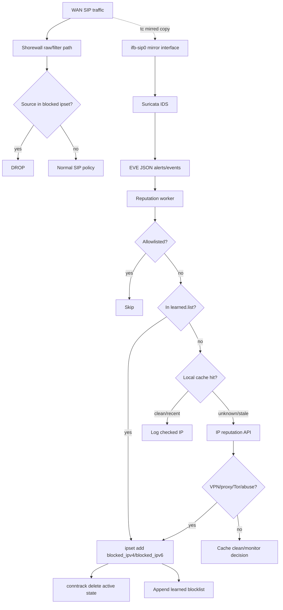
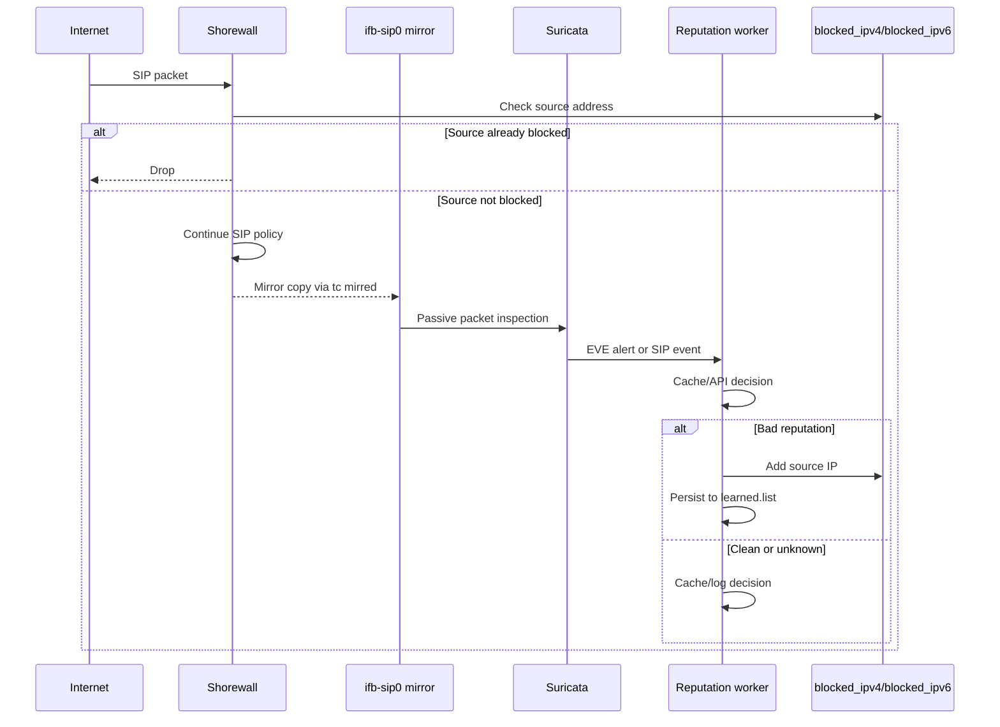

# SIP Reputation Blocking Architecture

This page documents the SIP abuse detection and blocking workflow built around
Shorewall, local packet mirroring, Suricata, and `geoipsets`.

The design keeps packet forwarding fast and local. Reputation lookups and
Suricata inspection run out of band, while Shorewall and ipset remain the
enforcement layer.

## Goals

- Drop known-bad public proxy, VPN, Tor, scanner, and abuse sources early.
- Mirror SIP traffic to Suricata without delaying live traffic.
- Use Suricata as the Layer 7 SIP detector.
- Keep manual and learned blocks persistent across reboots and ipset refreshes.
- Keep external API lookups outside the packet path.

## High-Level Flow



## Component Roles

| Component | Role |
| --- | --- |
| Shorewall | Enforces drops, allows trusted SIP policy, starts the mirror helper from `started`. |
| ipset | Holds live block sets such as `blocked_ipv4` and `blocked_ipv6`. |
| `geoipsets-ifbctl` | Creates the mirror interface and mirrors selected SIP ports using `tc flower` and `mirred`. |
| Suricata | Watches mirrored SIP traffic and writes alerts to `eve.json`. |
| `fetch-blocklists` | Downloads configured public abuse feeds into `/var/lib/geoipsets/blocklists/feeds`. |
| `refresh-blocklist` | Loads manual, dynamic, and learned lists into `blocked_ipv4` and `blocked_ipv6`. |
| `reputation-worker` | Optional local worker that reads Suricata EVE, checks IPQS/AbuseIPDB, and promotes bad IPs to ipset. |

## Packet Path



## Live Enforcement Sets

The package maintains these live block sets:

```text
blocked_ipv4
blocked_ipv6
```

Shorewall should drop these sets before general SIP allow rules.

Recommended policy order:

```text
1. allow explicitly trusted SIP peers
2. drop blocked_ipv4 / blocked_ipv6
3. drop high-confidence public feeds
4. allow geo/country SIP policy
5. reject/log everything else
```

## SIP Mirroring

The RPM installs:

```text
/usr/sbin/geoipsets-ifbctl
```

Common commands:

```bash
geoipsets-ifbctl start
geoipsets-ifbctl status
geoipsets-ifbctl stop
geoipsets-ifbctl restart
```

Example Shorewall hook in `/etc/shorewall/started`:

```bash
#!/usr/bin/bash
WAN_IF="ens3" MIRROR_TYPE=dummy SIP_PORTS="5060 5061 5084 5086 5087 5088" /usr/sbin/geoipsets-ifbctl start
return 0
```

`geoipsets-ifbctl start` resets the managed `clsact` qdisc before installing
filters, so Shorewall restarts and SIP port-list changes do not leave stale
filters behind.

The default mirror backend is `dummy`, while `MIRROR_TYPE=ifb` remains available
if a site specifically wants an IFB device. The dummy backend is preferred for
local passive capture because `tcpdump` and Suricata can read mirrored packets
directly from the interface.

Verification:

```bash
geoipsets-ifbctl status
tc -s filter show dev ens3 ingress
tcpdump -ni ifb-sip0 'port 5060 or port 5061 or port 5084 or port 5086 or port 5087 or port 5088'
```

## Suricata

Suricata listens on the mirror interface:

```text
ifb-sip0
```

EVE alerts are written to:

```text
/var/log/suricata/eve.json
```

Useful live alert view:

```bash
tail -f /var/log/suricata/eve.json \
  | jq -c 'select(.event_type=="alert") | {ts:.timestamp,src:.src_ip,dst:.dest_ip,proto:.proto,sid:.alert.signature_id,msg:.alert.signature,cat:.alert.category}'
```

Good default Suricata groups for promotion into reputation checks:

```text
emerging-voip.rules
emerging-scan.rules
emerging-dshield.rules
emerging-exploit.rules
emerging-malware.rules
emerging-worm.rules
tor.rules
classtype: trojan-activity
```

Treat `emerging-deleted.rules` carefully. It is better as log-only unless a
specific SID has been reviewed and approved for blocking.

The RPM ships local SIP reputation signal rules here:

```text
/usr/share/geoipsets/suricata/local-sip.rules
```

Install that file into the Suricata local rules directory. Suricata Update
should include local files through `update.yaml`, for example
`/var/lib/suricata/rules/*.rules`.

The local rules include a generic inbound INVITE reputation-check alert. That
alert triggers API lookup only; IPQS or AbuseIPDB still makes the block decision.
They also flag long numeric INVITE probes and repeated INVITE sources, which
catch call setup scans that walk destination numbers on non-default SIP ports.

Make sure Suricata's own `SIP_PORTS` variable includes every mirrored SIP port:

```yaml
vars:
  port-groups:
    SIP_PORTS: "[5060,5061,5084,5086,5087,5088]"
```

For repeatable provisioning:

```bash
geoipsets-provision-sip-suricata
WAN_IF=ens3 SIP_PORTS="5060 5061 5084 5086 5087 5088" geoipsets-provision-sip-suricata --mirror --reload
```

The provisioning helper installs the packaged local rules, runs
`suricata-update`, tests the Suricata configuration, and optionally calls
`geoipsets-ifbctl restart`. `geoipsets-ifbctl` remains the only helper that owns
dummy/IFB and `tc` mirror setup.

## Blocklist Sources

Manual local blocklist:

```text
/etc/geoipsets.blocklist
```

Manual drop-in blocklists:

```text
/etc/geoipsets.blocklist.d/*.list
```

Dynamic public feed config:

```text
/etc/geoipsets.blocklist-feeds.conf
```

The default dynamic feed config includes DShield using an explicit parser:

```text
@dshield https://feeds.dshield.org/feeds/block.txt dshield
```

The `dshield` parser converts the SANS ISC/DShield tabular range feed into CIDR
entries such as `64.62.197.0/24`.

Fetched dynamic feeds:

```text
/var/lib/geoipsets/blocklists/feeds/*.list
```

Learned local blocklist:

```text
/var/lib/geoipsets/blocklists/learned.list
```

## Permanent Block List Updates

Use `/etc/geoipsets.blocklist` for operator-managed permanent blocks. Add one IP
address or CIDR per line.

Example:

```bash
sudoedit /etc/geoipsets.blocklist
```

Add:

```text
45.146.55.104
203.0.113.0/24
2001:db8:bad::/48
```

Apply immediately:

```bash
sudo /usr/libexec/geoipsets/refresh-blocklist
```

Verify:

```bash
sudo ipset list blocked_ipv4 -name
sudo ipset test blocked_ipv4 45.146.55.104
```

For IPv6:

```bash
sudo ipset test blocked_ipv6 2001:db8:bad::1
```

The block remains persistent because it is stored in `/etc/geoipsets.blocklist`
and will be reloaded by the timer/service.

## Temporary or Learned Blocks

Temporary firewall-side traps can use timeout ipsets, such as `blk_acl`, for
short-term blocking.

The reputation worker should persist confirmed bad sources to:

```text
/var/lib/geoipsets/blocklists/learned.list
```

Then run:

```bash
sudo /usr/libexec/geoipsets/refresh-blocklist
```

The packaged local worker performs live enforcement after a positive reputation
result:

```bash
sudo ipset add blocked_ipv4 45.146.55.104 -exist
sudo conntrack -D -f ipv4 -s 45.146.55.104 2>/dev/null || true
printf '%s\n' 45.146.55.104 | sudo tee -a /var/lib/geoipsets/blocklists/learned.list
```

The worker also keeps a local SQLite cache:

```text
/var/lib/geoipsets/reputation/reputation.sqlite
```

## Dynamic Public Feeds

Dynamic feeds are configured in:

```text
/etc/geoipsets.blocklist-feeds.conf
```

The foomuri-style source catalog can look like this:

```text
iplist {
        @ipv4_CA  https://raw.githubusercontent.com/ipverse/rir-ip/master/country/ca/ipv4-aggregated.txt
        @ipv4_US  https://raw.githubusercontent.com/ipverse/rir-ip/master/country/us/ipv4-aggregated.txt
        @blocklist_de https://lists.blocklist.de/lists/all.txt
        @techmdw https://blacklist.techmdw.com/
        @greensnow https://blocklist.greensnow.co/greensnow.txt
        @et https://rules.emergingthreats.net/fwrules/emerging-Block-IPs.txt
        @interserver https://rbldata.interserver.net/ip.txt
        @stopforumspam https://www.stopforumspam.com/downloads/toxic_ip_cidr.txt
        @spamhausdrop https://cascadiacrow.com/spamhausblocks.txt
        @spamhausdropv6 https://www.spamhaus.org/drop/dropv6.txt
        @blocklist_net_ua https://iplists.firehol.org/files/blocklist_net_ua.ipset
        @abuseipdb https://raw.githubusercontent.com/borestad/blocklist-abuseipdb/main/abuseipdb-s100-14d.ipv4
}
```

For `geoipsets.blocklist-feeds.conf`, enable only feeds that should be loaded
into `blocked_ipv4` and `blocked_ipv6`. Do not enable `@ipv4_CA` or `@ipv4_US`
in this file because those are country/policy inputs, not abuse block feeds.

Recommended block-feed config:

```text
iplist {
    @blocklist_de https://lists.blocklist.de/lists/all.txt
    @techmdw https://blacklist.techmdw.com/
    @greensnow https://blocklist.greensnow.co/greensnow.txt
    @et https://rules.emergingthreats.net/fwrules/emerging-Block-IPs.txt
    @interserver https://rbldata.interserver.net/ip.txt
    @stopforumspam https://www.stopforumspam.com/downloads/toxic_ip_cidr.txt
    @spamhausdrop https://cascadiacrow.com/spamhausblocks.txt
    @spamhausdropv6 https://www.spamhaus.org/drop/dropv6.txt
    @blocklist_net_ua https://iplists.firehol.org/files/blocklist_net_ua.ipset
    @abuseipdb https://raw.githubusercontent.com/borestad/blocklist-abuseipdb/main/abuseipdb-s100-14d.ipv4
}
```

Fetch and apply:

```bash
sudo /usr/libexec/geoipsets/fetch-blocklists
sudo /usr/libexec/geoipsets/refresh-blocklist
```

`refresh-blocklist` auto-sizes `blocked_ipv4` and `blocked_ipv6` from the number
of loaded entries. The default minimum `maxelem` is `1048576`; if feeds grow
larger, the helper adds 25% headroom above the loaded entry count.

## Systemd Refresh

The packaged update service runs:

```text
/usr/libexec/geoipsets/update-all
```

`update-all` runs the country database update, refreshes country ipsets, fetches
dynamic abuse feeds, and refreshes `blocked_ipv4` and `blocked_ipv6`. If the
DB-IP country database download fails, dynamic abuse feeds are still fetched and
the block ipsets are still refreshed. The service exits nonzero afterward so the
journal still reports the country database failure.

Manual run:

```bash
sudo systemctl start update-geoipsets.service
sudo journalctl -u update-geoipsets.service -n 100 --no-pager
```

If legacy Shorewall country set names are needed:

```ini
[Service]
Environment=REFRESH_IPSET_ARGS=--legacy
```

Country ipsets are auto-sized with 25% headroom during refresh. If a larger
minimum is needed:

```ini
[Service]
Environment=COUNTRY_MAXELEM=2097152
```

If very large public feeds need a higher minimum blocklist ipset size:

```ini
[Service]
Environment=BLOCKLIST_MAXELEM=2097152
```

Manual one-time refresh with a larger minimum:

```bash
sudo /usr/libexec/geoipsets/refresh-blocklist --maxelem 2097152
```

After RPM upgrades, check whether RPM kept a new feed catalog as:

```text
/etc/geoipsets.blocklist-feeds.conf.rpmnew
```

If that file exists, merge it into `/etc/geoipsets.blocklist-feeds.conf` or
replace the old file, then run:

```bash
sudo /usr/libexec/geoipsets/fetch-blocklists
sudo /usr/libexec/geoipsets/refresh-blocklist
```

## Reputation API Design

The reputation worker is intentionally outside the packet path.

The RPM installs the local stage-1 worker:

```text
/usr/libexec/geoipsets/reputation-worker
/usr/lib/systemd/system/geoipsets-reputation-worker.service
/etc/geoipsets-reputation.env
/usr/share/geoipsets/suricata/local-sip.rules
```

Configure local API keys in `/etc/geoipsets-reputation.env`:

```bash
IPQS_API_KEY=replace-with-ipqualityscore-key
ABUSEIPDB_API_KEY=replace-with-abuseipdb-key
```

Enable it:

```bash
systemctl enable --now geoipsets-reputation-worker.service
journalctl -u geoipsets-reputation-worker.service -f
```

The service joins the `suricata` supplementary group so it can read
`/var/log/suricata/eve.json` without granting broad DAC bypass capabilities.

The worker supports IPQualityScore for proxy, VPN, Tor, recent abuse, bot, and
fraud score signals. It supports AbuseIPDB for abuse confidence score and Tor
signals.

The local allow list is checked first and always wins. The learned list is
checked before the SQLite cache and before any reputation API lookup, so
previously confirmed offenders are enforced locally without spending API quota.

By default, SIP parser `INVITE` and `REGISTER` events trigger reputation checks
immediately. `OPTIONS` parser events must repeat before lookup:

```ini
SIP_EVENT_METHODS="OPTIONS REGISTER INVITE"
SIP_EVENT_IMMEDIATE_METHODS="INVITE REGISTER"
SIP_EVENT_MIN_COUNT=2
SIP_EVENT_WINDOW=300
```

Recommended decision order:

```text
1. Suricata alert fires.
2. SIP INVITE or REGISTER parser event fires.
3. SIP OPTIONS parser event repeats enough times to cross the local threshold.
4. Worker extracts source IP from EVE JSON.
5. Worker skips private, reserved, and allowlisted IPs.
6. Worker enforces sources already present in `learned.list` without API lookup.
7. Worker checks local SQLite cache.
8. Worker calls IPQS and/or AbuseIPDB only for unknown/stale IPs.
9. If bad, worker adds IP to live ipset, deletes conntrack state, and persists it.
10. If clean, worker caches/logs the checked result.
```

Suggested block policy:

```text
block if:
  vpn == true
  or proxy == true
  or tor == true
  or fraud_score >= 85
  or recent_abuse == true
  or abuse_confidence >= 90
```

Avoid blocking on datacenter/hosting alone. Valid SIP providers and monitoring
nodes may run from datacenter networks.

## Troubleshooting

Check mirror filters:

```bash
geoipsets-ifbctl status
tc -s filter show dev ens3 ingress
```

Check mirrored packets:

```bash
tcpdump -ni ifb-sip0 'port 5060 or port 5061 or port 5084 or port 5086 or port 5087 or port 5088'
```

If `tc -s filter show dev ens3 ingress` shows packets but `tcpdump` or
Suricata sees nothing, restart the mirror with the dummy backend:

```bash
WAN_IF=ens3 MIRROR_TYPE=dummy SIP_PORTS="5060 5061 5084 5086 5087 5088" geoipsets-ifbctl restart
```

Check Suricata:

```bash
systemctl status suricata
journalctl -u suricata -n 100 --no-pager
tail -f /var/log/suricata/eve.json
```

Check block sets:

```bash
ipset list -name | grep blocked
ipset list blocked_ipv4 | head
ipset list blocked_ipv6 | head
```

Check dynamic feeds:

```bash
ls -la /var/lib/geoipsets/blocklists/feeds/
/usr/libexec/geoipsets/fetch-blocklists
```
